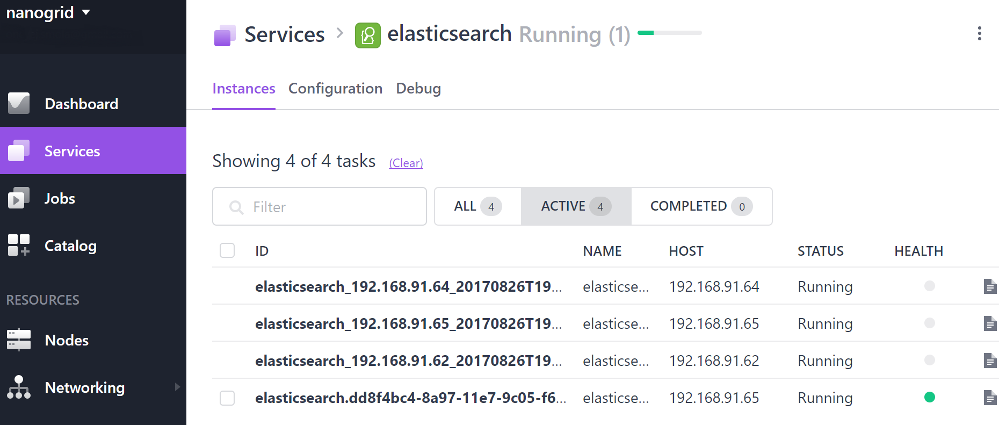
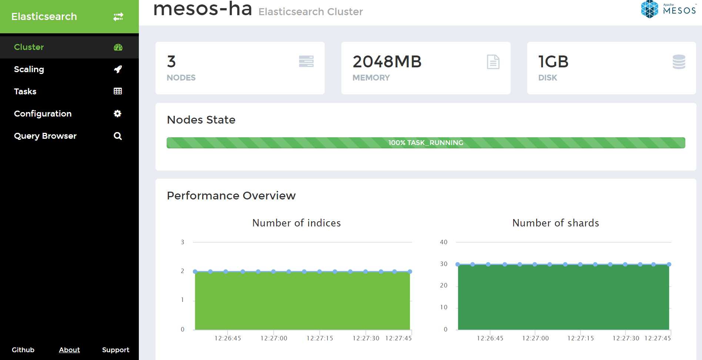

# How to use Elasticsearch on DC/OS

[Elasticsearch](https://www.elastic.co/products/elasticsearch) is a distributed, RESTful search and analytics engine.
The [DC/OS Elasticsearch](https://github.com/mesos/elasticsearch) service is a Mesos framework that allows you to manage
and use Elasticsearch in a flexible and scalable way.

- Estimated time for completion: 5 minutes
- Target audience: Data engineers and appops that want an search engine.
- Scope: Install and use Elasticsearch.

**Table of Contents**:

- [Prerequisites](#prerequisites)
- [Install Elasticsearch](#install-elasticsearch)
- [Use Elasticsearch](#use-elasticsearch)
- [Uninstall Elasticsearch](#uninstall-elasticsearch)

## Prerequisites

- A running DC/OS 1.10 cluster with 3 agents with each 1 CPU, 3 GB of RAM and 1 GB of disk space available.
- [DC/OS CLI](https://dcos.io/docs/1.10/cli/install/) installed.

## Install Elasticsearch

To install Elasticsearch, do:

```bash
$ dcos package install elasticsearch
This DC/OS Service is no longer maintained. See beta-elastic. The ElasticSearch DCOS Service implementation is alpha and there may be bugs, incomplete features, incorrect documentation or other discrepancies.
Continue installing? [yes/no] yes
Installing Marathon app for package [elasticsearch] version [1.0.1-2]
Elasticsearch is staging. Check Marathon and the ES management front-end for status.
```

After this, you should see the Elasticsearch service running via the `Services` tab of the DC/OS UI:


## Use Elasticsearch

In the following we will use the DC/OS [Admin Router](https://dcos.io/docs/1.10/developing-services/#-a-name-adminrouter-a-admin-router-and-web-interface-integration) to provide access to the Elasticsearch UI: use the URL `http://$DCOS_DASHBOARD/service/elasticsearch/` and replace `$DCOS_DASHBOARD` with the URL of your DC/OS UI:



Let's create an index now from within the DC/OS cluster (note that the endpoint URL, for example, `10.0.3.228:1025` in our example can be discovered via the Elasticsearch UI in the `Tasks` tab; pick any task and use the value from the `IP address` column):

```bash
$ dcos node ssh --master-proxy --leader

core@ip-10-0-6-55 ~ $ curl -XPUT 10.0.3.228:1025/customer?pretty
{
  "acknowledged" : true
}

core@ip-10-0-6-55 ~ $ curl 10.0.3.228:1026/_cat/indices?v
health status index    pri rep docs.count docs.deleted store.size pri.store.size
green  open   customer   5   2          0            0      1.9kb           650b
```

Next, we index some data (input is provided as a JSON document):

```bash
core@ip-10-0-6-55 ~ $ curl -XPUT 10.0.3.228:1025/customer/external/1?pretty -d '
{
   "name": "Dave C Os"
}'
{
  "_index" : "customer",
  "_type" : "external",
  "_id" : "1",
  "_version" : 1,
  "_shards" : {
    "total" : 3,
    "successful" : 3,
    "failed" : 0
  },
  "created" : true
}
```

Now, let's shift gears and use the Elasticsearch UI for search. For that, change to the `Query Browser` tab and enter `Dave` in the input field.
You should then see the following:


## Uninstall Elasticsearch

To uninstall Elasticsearch:

```bash
$ dcos package uninstall elasticsearch
WARNING: This action cannot be undone. This will uninstall [elasticsearch] and delete all of its persistent data (logs, configurations, database artifacts, everything).
Please type the name of the service to confirm: elasticsearch
Uninstalled package [elasticsearch] version [1.0.1-2]
```

## Further resources

1. [DC/OS Elasticsearch Official Documentation](http://mesos-elasticsearch.readthedocs.io/en/latest/)
1. [Elasticsearch 2.4 docs](https://www.elastic.co/guide/en/elasticsearch/reference/2.4/index.html)


